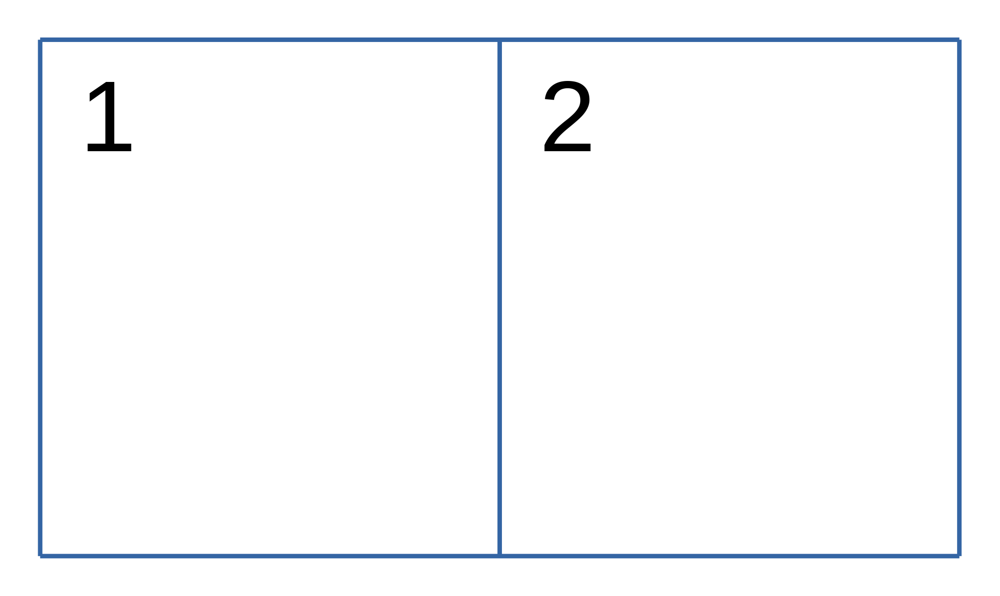
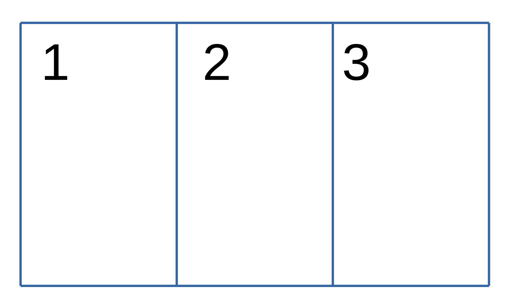
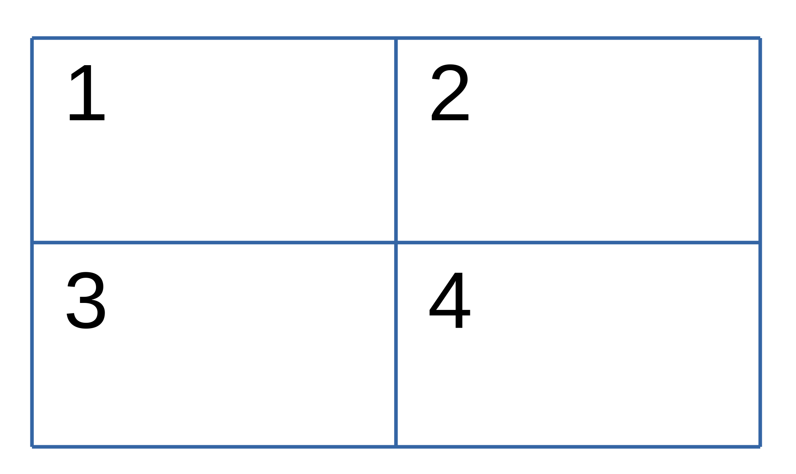
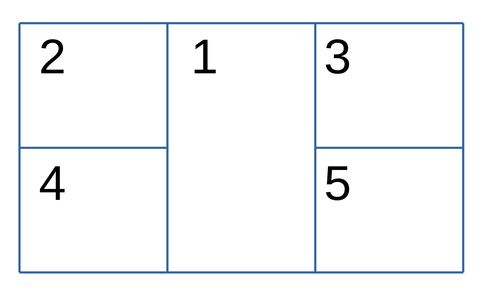
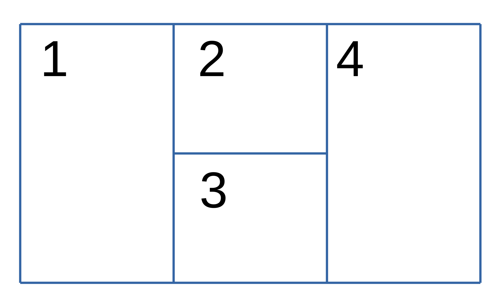
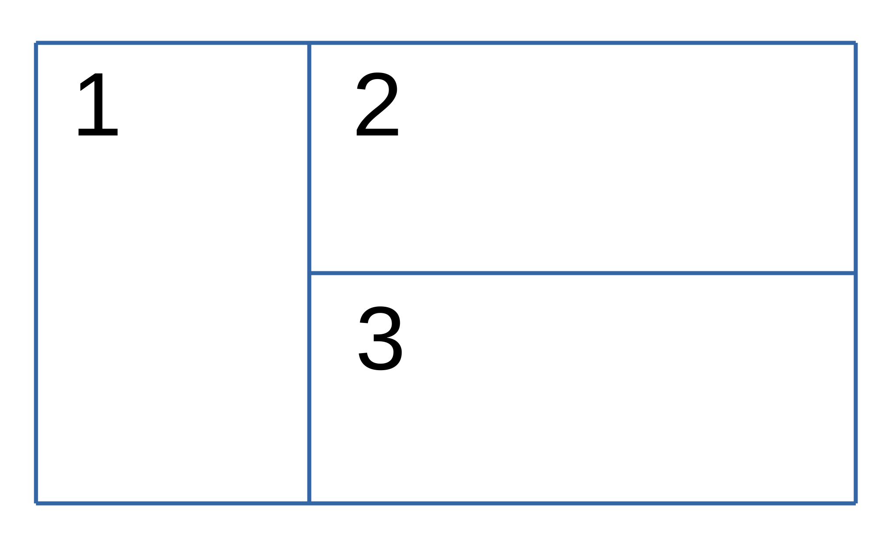
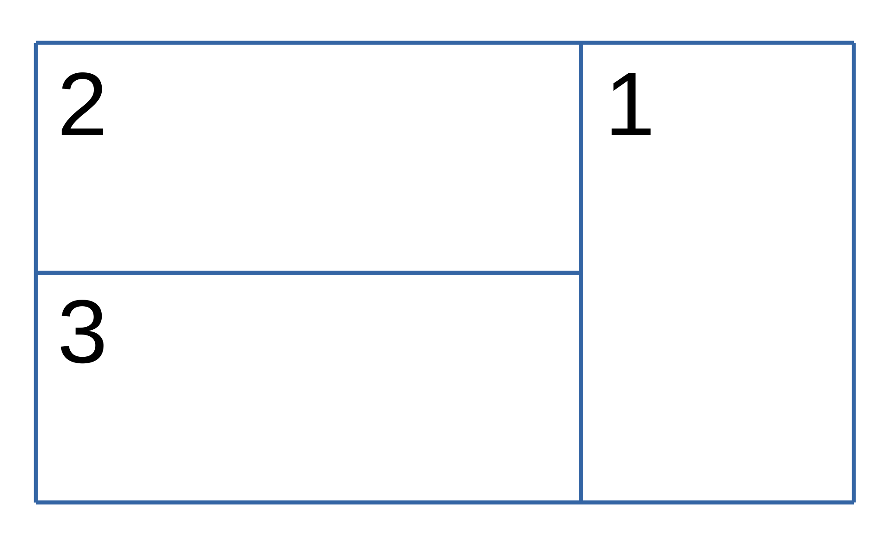

## Commandline utility to join 2-5 groups of videos into a single video:

```
video_joiner.exe -h 
Usage: video_joiner.exe [OPTIONS]

Options:
  -f, --folder <INPUT_FOLDER>   Target *folder* holding videos to join: if unused a request will be given via text input.
                                - Example to automatically split items into groups: -f "C:\Users\username\Videos\videos_to_join\"
                                - Example to use folder as a group: -f "D:\videos\left" -f "D:\videos\mid" -f "D:\videos\right"
  -o, --output <OUTPUT_FILE>    Target *file* to output joined video (requires extension)
                                if unused a request will be given via text input;
                                - Example: C:\Users\username\Videos\example.mp4
  -s, --shape <SPLIT_FORMAT>    Shape Format: 'Double' 'Triple' 'Quad' 'VertEmph' 'HorizEmph'
                                see README.md for more layouts and layout diagrams
                                if unused a request will be given via text input
  -y, --height <OUTPUT_HEIGHT>  Output height in pixels [default:1440]
  -x, --width <OUTPUT_WIDTH>    Output width in pixels [default:2550]
  -r, --fps <FPS>               Frame Per Second [default: 30]
      --ord <ORD>               Apply sorting method Options include: 
                                    "1", "Random", "rand" (default)
                                    "2", "RandomSeeded", "seed"
                                    "3", "ShortestFirst", "shortest"
                                    "4", "LongestFirst", "longest"
                                    "5", "RandomWithLargestLast", "rwll"
      --ord-opt <ORD_OPT>       select seed for ord when RandomSeeded is chosen [default: 1337]
      --no-audio                removes audio completely
  -h, --help                    Print help
  -V, --version                 Print version
```

##       

Join a folder of videos in the `Double` layout at 1080p 60fps

```shell
video_joiner.exe -f "D:\videos_to_join" -o "D:\joined_video.mp4" -s 'Double' -x 1920 -y 1080 -r 60
```

Join a folder of videos in the `Double` layout for testing without audio at a 400x300 with lower fps for faster
encoding

```shell
video_joiner.exe -f "D:\videos_to_join" -o "D:\joined_video.mp4" -s 2 --no-audio -x 400 -y 300 --fps 15
```

Join 4 folders into the horizontal emphasis layout, using folder 1 and 2 as the vertical video components.
The order if `-f` inputs is important, see standard layouts for the order in which the frames will be placed.

```shell
video_joiner.exe 
    -f "D:\video_grp_1" 
    -f "D:\video_grp_3" 
    -f "D:\video_grp_4" 
    -f "D:\video_grp_2" 
    -o "D:\joined_video.mp4" 
    --shape "HorizEmph"
```

#### Special case

Shapes with multiple sub-frame shapes may use a 2 folder input structure with automatic sorting.
When only two inputs are given, the first refrences the more vertical component,
and the second refrences the horizontal component.

The method shown below will automatically choose items from the vertical section to fill positions 1 and 4,
then take items from the second file selection for positions 2 and 3. \
_Currently implemented for commandline only._

```shell
video_joiner.exe -f "D:\vertical_videos_to_join" -f "D:\horizontal_videos_to_join" -o "D:\joined_video.mp4" --shape "HorizEmph"
```

Implemented for `VertEmph`, `VertEmph1`, `HorizEmph`, and `HorizEmph2`

## Sorting Options
- "1", "Random", "rand" (default)
  - using thread rng, each video group is randomized
- "2", "RandomSeeded", "seed"
  - using seeded random, requires use `--ord-opt` to change
- "3", "ShortestFirst", "shortest"
  - sorts the inputs by shortest first
- "4", "LongestFirst", "longest"
  - sort inputs by longest first
- "5", "RandomWithLargestLast", "rwll"
  - sorts items with random, then pops the largest video and appends it to the end

<hr> 

## Audio & why exports can be slow

audio export can be slow as it cannot be started untill the video export is complete, each video group will be
concatenated to its own single `.wav` file, once a full length file is exported for each video group it will then be
encoded into the previously created `__temp__filename.ext` video file using FFmpeg `-c:v copy` to ensure we don't
re-encode

The audio joining method is currently implemented in `video::FrameShape::audio_args_with_vid()`\
Basic descriptions of how each method works can be found below

- `FFmpeg loudnorm` is used for postprocessing all inputs once joined

| `Double`                     |               Vertical Group 1                |               Vertical Group 2               |
|:-----------------------------|:---------------------------------------------:|:--------------------------------------------:|
| **Horizontal <br/> Group 1** | Stereo balance: -0.4<br/> Surround angle: -90 | Stereo balance: +0.4<br/>Surround angle: +90 |

| `Triple`                     |                Vertical Group 1                 | Vertical Group 2 |               Vertical Group 3               |
|:-----------------------------|:-----------------------------------------------:|:----------------:|:--------------------------------------------:|
| **Horizontal <br/> Group 1** | Stereo balance: -0.4 <br/>  Surround angle: -90 |   _no change_    | Stereo balance: +0.4<br/>Surround angle: +90 |

| `Quad`                       |                Vertical Group 1                 |                Vertical Group 2                 |
|:-----------------------------|:-----------------------------------------------:|:-----------------------------------------------:|
| **Horizontal <br/> Group 1** |               Surround angle: -45               |               Surround angle: +45               |
| **Horizontal <br/> Group 2** | Stereo balance: -0.4 <br/>  Surround angle: -90 | Stereo balance: -0.4 <br/>  Surround angle: -90 |

| `VertEmph` and `VertEmph2`   |                Vertical Group 1                 | Vertical Group 2 |               Vertical Group 3               |
|:-----------------------------|:-----------------------------------------------:|:----------------:|:--------------------------------------------:|
| **Horizontal <br/> Group 1** |               Surround angle: -45               |   _no change_    |             Surround angle: +45              |
| **Horizontal <br/> Group 2** | Stereo balance: -0.4 <br/>  Surround angle: -90 |       <hr>       | Stereo balance: +0.4<br/>Surround angle: +90 |

| `HorizEmph` and `HorizEmph2` |                         Vertical Group 1                          | Vertical Group 2 |                        Vertical Group 3                        |
|:-----------------------------|:-----------------------------------------------------------------:|:----------------:|:--------------------------------------------------------------:|
| **Horizontal <br/> Group 1** | Stereo balance: -0.4 <br/>  Surround angle: -90 <br/> Volume -5db |   _no change_    | Stereo balance: +0.4<br/>Surround angle: +90 <br/> Volume -5db |
| **Horizontal <br/> Group 2** |                               <hr>                                |   Volume -3db    |                              <hr>                              |

| `SideVert `                  |               Vertical Group 1                |                         Vertical Group 2                          |
|:-----------------------------|:---------------------------------------------:|:-----------------------------------------------------------------:|
| **Horizontal <br/> Group 1** | Surround angle: -90 <br> Stereo balance: -0.5 |         Stereo balance: +0.1  <br/>  Surround angle: +20          |
| **Horizontal <br/> Group 2** |                     <hr>                      | Stereo balance: +0.1  <br/>  Surround angle: +20 <br> Volume -5db |

| `SideVert2`                  |                         Vertical Group 1                          |  Vertical Group 2   |
|:-----------------------------|:-----------------------------------------------------------------:|:-------------------:|
| **Horizontal <br/> Group 1** |         Stereo balance: -0.1  <br/>  Surround angle: -20          | Surround angle: +90 |
| **Horizontal <br/> Group 2** | Stereo balance: -0.1  <br/>  Surround angle: -20 <br> Volume -5db |        <hr>         |

## Frame Shape names

### Standard layouts:

| `Double` or `D` or `2`                                | `Triple` or `T` or `3`                                | `Quad` or `Q` or `4`                                  |
|-------------------------------------------------------|-------------------------------------------------------|-------------------------------------------------------|
|  |  |  |

### Non-Standard layouts:

| `VertEmph` or `V` or `5`                                  | `HorizEmph` or `H` or `6`                                 |
|-----------------------------------------------------------|-----------------------------------------------------------|
|      |      |
| Frame 1: `5.33/9` when exporting at `16/9`                | Frame 1/4: `5.33/9` when exporting at `16/9`              |
| Equal frame widths means excessive cropping of 16/9 video | Equal frame widths means excessive cropping of 16/9 video | 

| `VertEmph2` or `V2` or `7`                            | `HorizEmph2` or `H2` or `8`                           |
|-------------------------------------------------------|-------------------------------------------------------|
|  |  |
| Top row `3/8` `2/8` `3/8`                             | Top row: `1/4` `2/4` `1/4`                            | 
| Enlarged side frames to reducing cropping             | Enlarged centre frame to reduce cropping              | 

| `SideVert` or `VD` or `9`                             | `SideVert2` or `DV` or `10`                           |
|-------------------------------------------------------|-------------------------------------------------------|
|  |  |
| Top row `1/3` `2/3`                                   | Top row `2/3` `1/3`                                   |
| Enlarged side frames to reducing cropping             | Enlarged side frames to reducing cropping             |

## To be integrated at some point:

✅ Allow for multiple input folders, one per split position  
✅ Multithread early audio exporting - complete for 0.2.1
✅ Allow for ordered video inputs, possibly by simple sorting methods  
❌ nxn video joins - not happening unless I can figure a really elegant way to do these joins.  
❌ allow for a centre overlay  
❌ audio modification switches for generic pre-implemented methods.  
❌ allow .txt file inputs for audio modification
