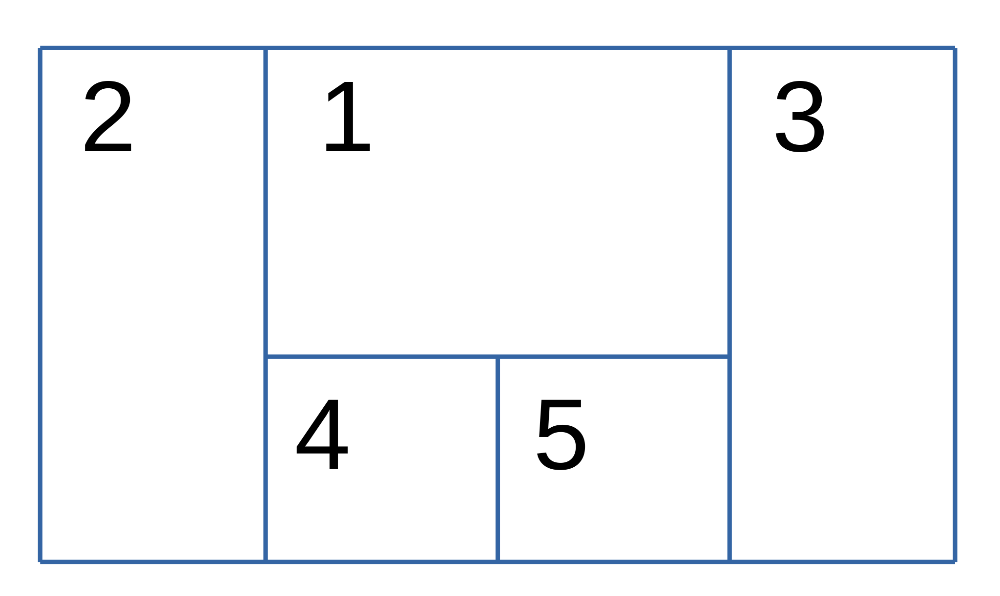
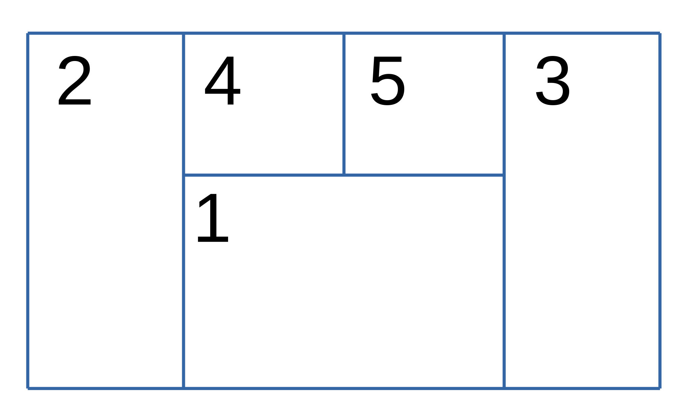
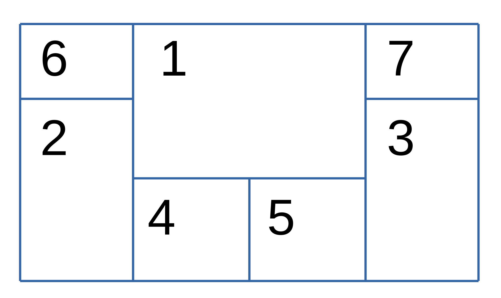
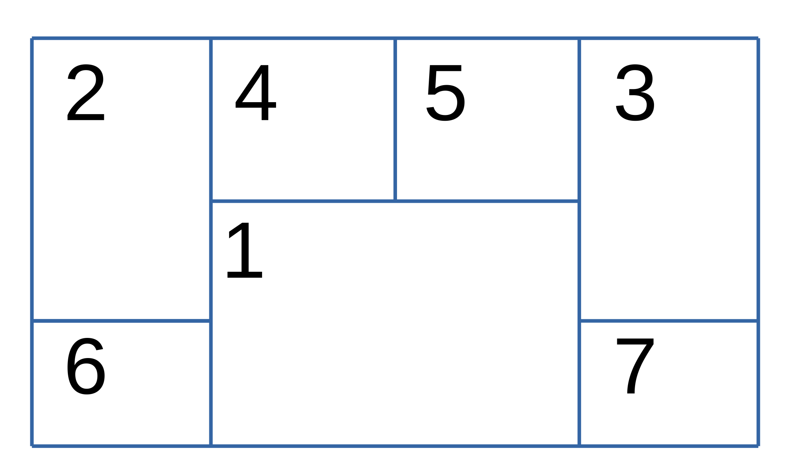
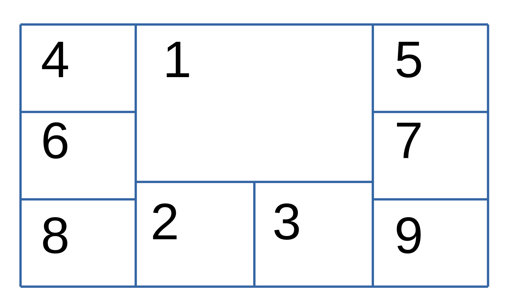
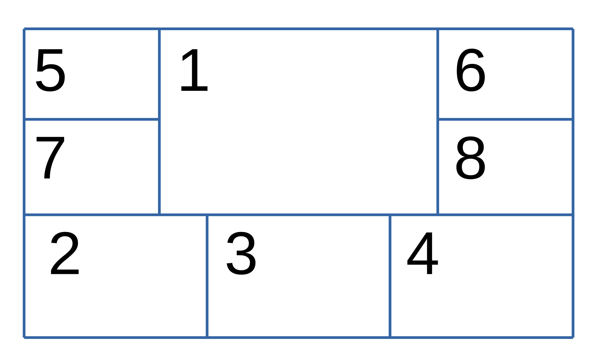

| ID | Short | Long Name            | Input groupings                        | Diagram                                     |                                          
|----|-------|----------------------|----------------------------------------|---------------------------------------------|
| 2  | `D`   | `Double`             | -                                      |    |
| 3  | `T`   | `Triple`             | -                                      |    |
| 4  | `Q`   | `Quad`               | -                                      |    |
| 5  | `V`   | `VertEmph`           | -                                      |    |
| 6  | `H`   | `HorizEmph`          | -                                      |    |
| 7  | `V`   | `VertEmph`           | -                                      |    |
| 8  | `H`   | `HorizEmph`          | -                                      |    |
| 9  | `VD`  | `SideVert`           | -                                      |    |
| 10 | `DV`  | `SideVert2`          | -                                      |    |
| 11 | `CE`  | `CentreEmphVert`     | `[(1) (2-3) (4-5)]`                    |    |
| 12 | `CE2` | `CentreEmphVert2`    | `[(1) (2-3) (4-5)]`                    |  |
| 13 | `MH`  | `MoreHoriz`          | `[(1) (2-3) (4-7)]`  `[(2-3) (1,4-9)]` |    |
| 14 | `MH2` | `MoreHoriz2`         | `[(1) (2-3) (4-7)]`  `[(2-3) (1,4-9)]` |  |
| 15 | -     | `ExtendedLandscape`  | `[(1) (2-3) (4-9)]` `[(1-3) (4-9)]`    |  |
| 16 | -     | `ExtendedLandscape2` | `[(1) (2-4) (5-8)]`                    |  |
