| `-s <item>` == `--shape <item>`                    | Diagram                                     | groupings                                               |                            |
|----------------------------------------------------|---------------------------------------------|---------------------------------------------------------|----------------------------|
| `-s 1`    `-s Mono`                 `-s M`   | no joins                                    | N/A                                                     |                            |
| `-s 2`    `-s Double`               `-s D`   | 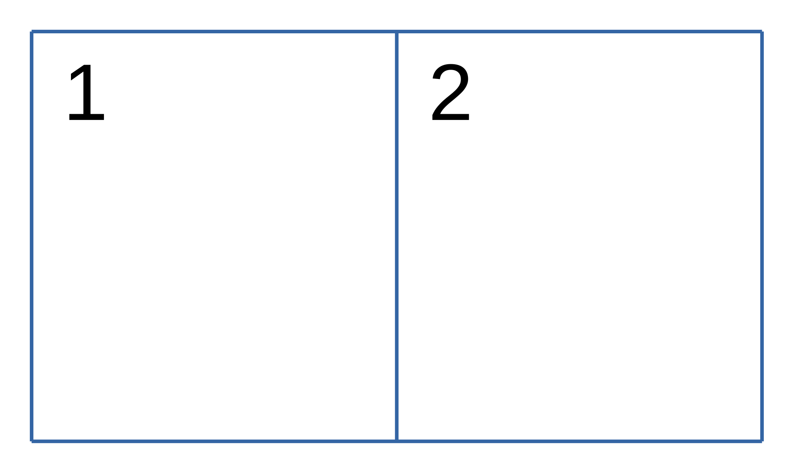   | N/A                                                     |                            |
| `-s 3`    `-s Triple`               `-s T`   | 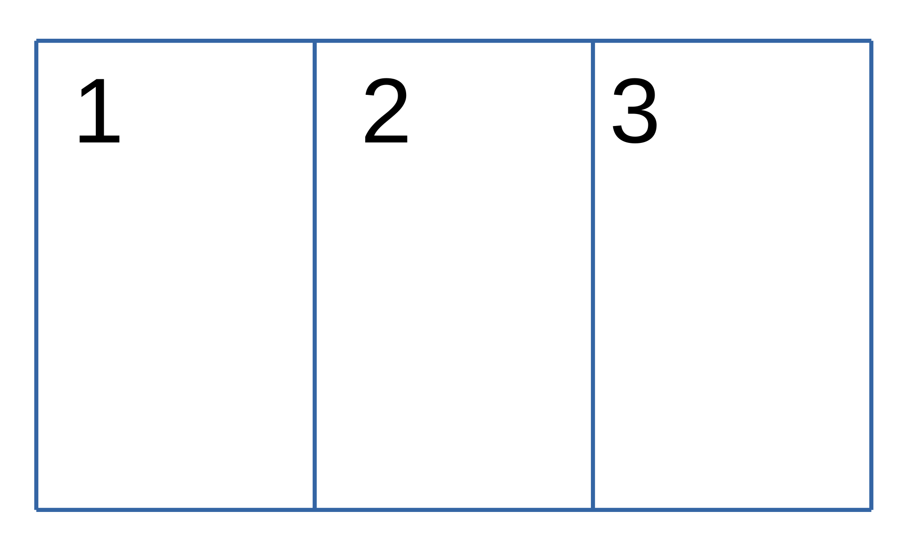   | N/A                                                     |                            |
| `-s 4`    `-s Quad`                 `-s Q`   | 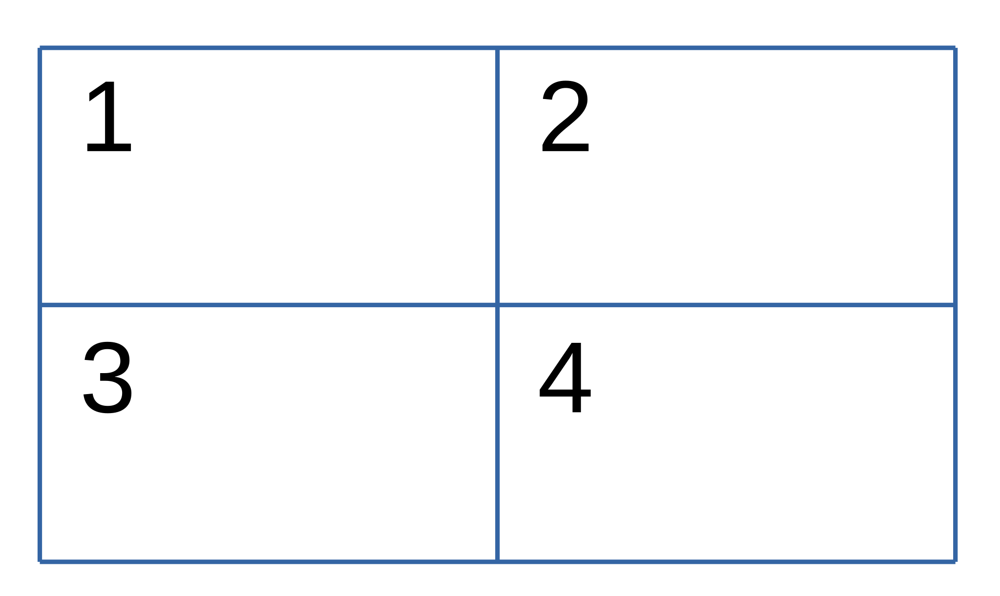   | N/A                                                     |                            |
| `-s 5`    `-s VertEmph`             `-s V`   | 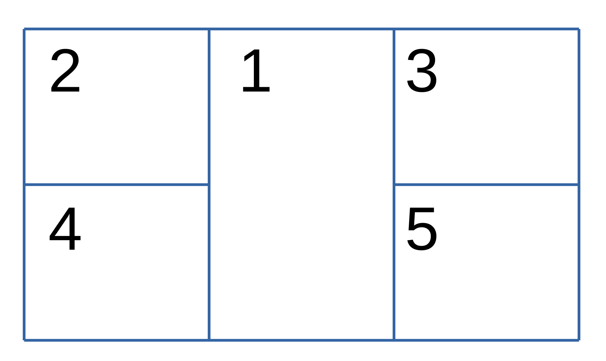   | `[1],[2-5]`                                             | Widths:   1/3, 1/3, 1/3 |
| `-s 7`    `-s VertEmph2`            `-s V2`  |    | `[1],[2-5]`                                             | Widths:   3/8, 2/8, 3/8 |
| `-s 6`    `-s HorizEmph`            `-s H`   | 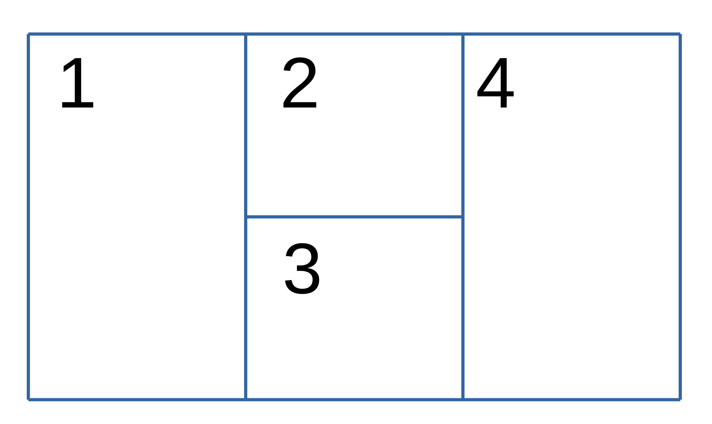   | `[1,4],[2,3]`                                           | Widths:   1/3, 1/3, 1/3 |
| `-s 8`    `-s HorizEmph2`           `-s H2`  |    | `[1,4],[2,3]`                                           | Widths:   1/4, 1/2, 1/4 |
| `-s 9`    `-s SideVert`             `-s S`   | 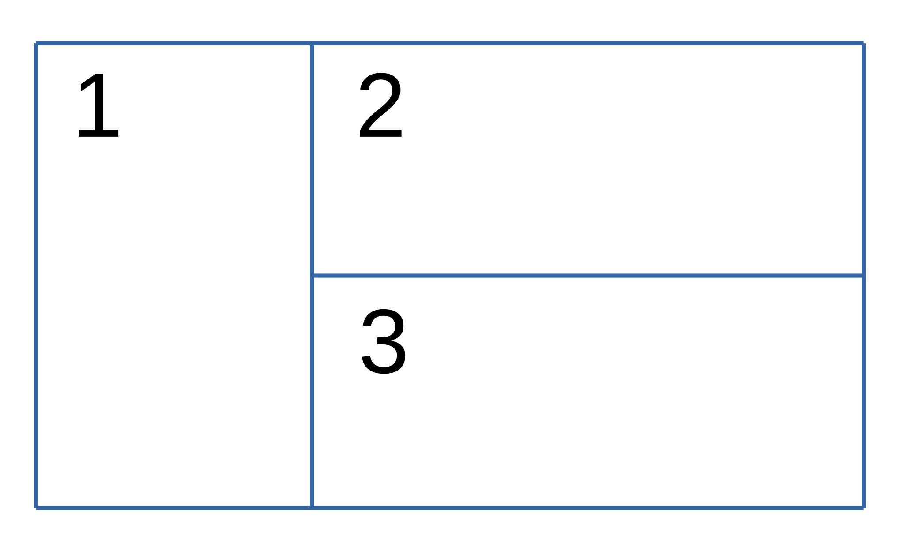   | `[1],[2,3]`                                             |                            |
| `-s 10`   `-s SideVert2`            `-s S2`  | 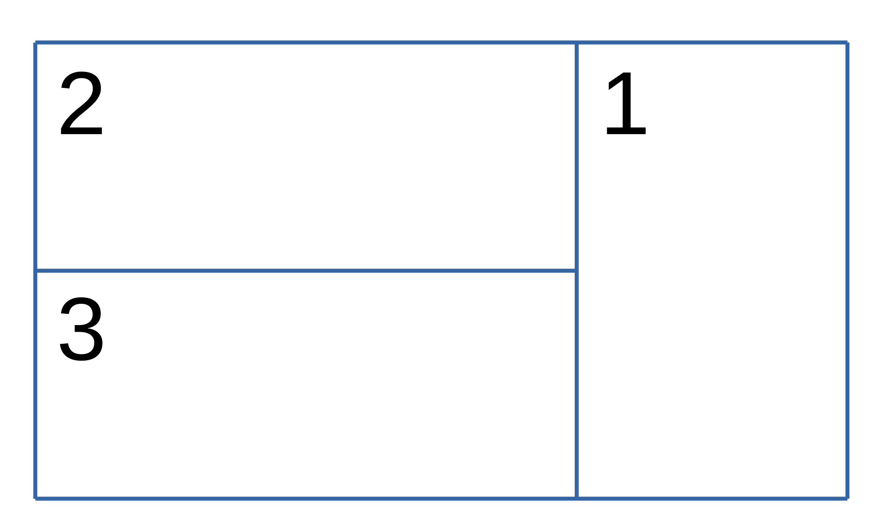   | `[1],[2,3]`                                             |                            |
| `-s 11`   `-s CentreEmphVert`       `-s CE`  | 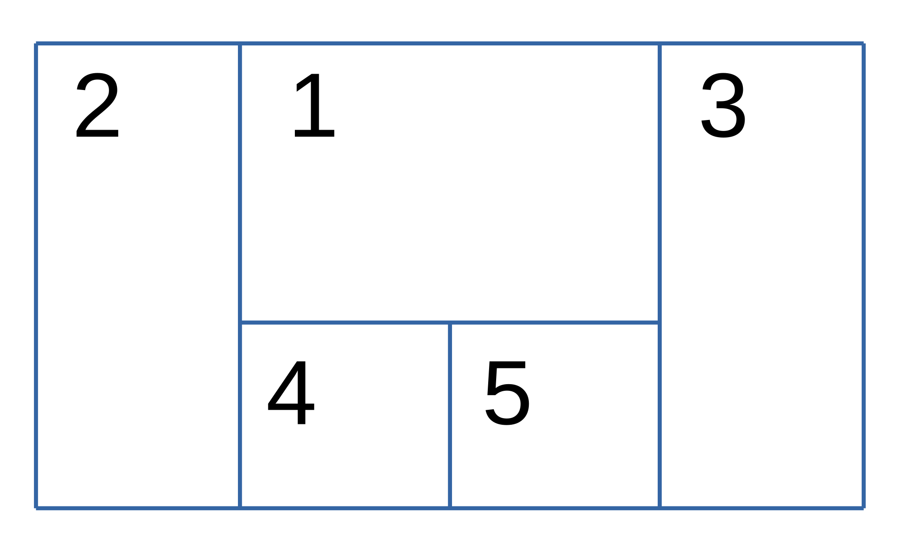   | `[1],[2,3],[4,5]` 
 `[1,4,5],[2,3]`                  |                            |
| `-s 12`   `-s CentreEmphVert2`      `-s CE2` | 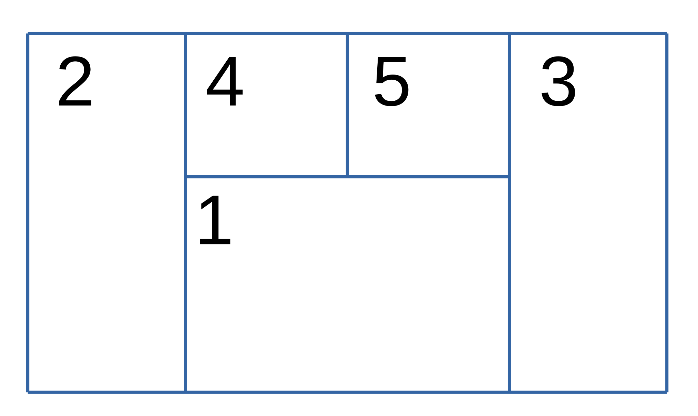 | `[1],[2,3],[4,5]` 
 `[1,4,5],[2,3]`                  |                            |
| `-s 13`   `-s MoreHoriz`            `-s MH`  | 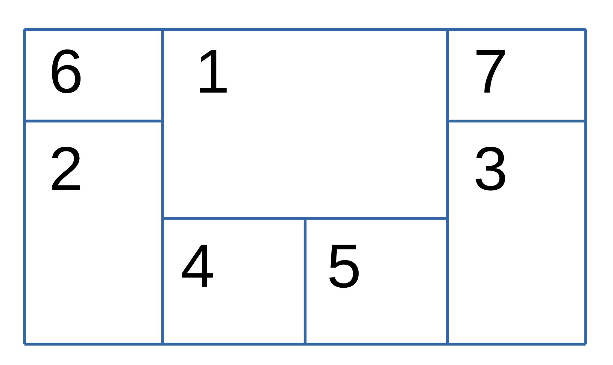   | `[1],[2,3],[4,5,6,7]`  
  `[1,4,5,6,7],[2,3]`        |                            |
| `-s 14`   `-s MoreHoriz2`           `-s MH2` | 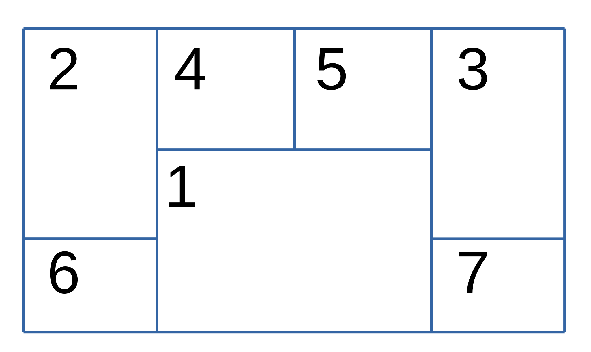 | `[1],[2,3],[4,5,6,7]`  
  `[1,4,5,6,7],[2,3]`        |                            |
| `-s 15`   `-s ExtendedLandscape`    `-s EL`  | 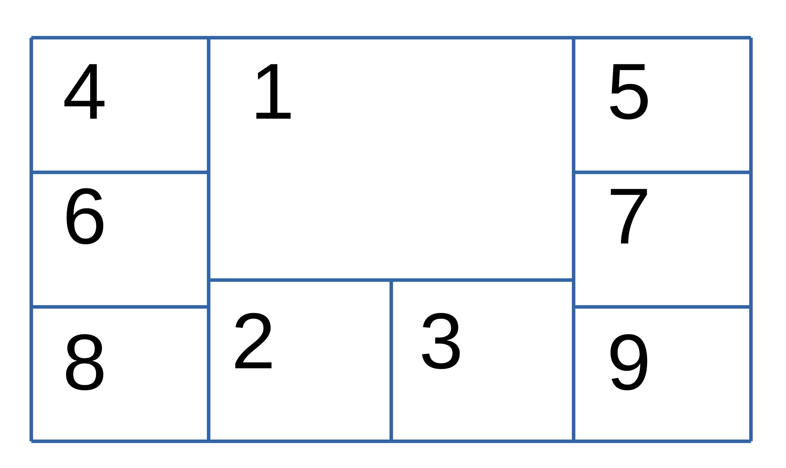 | `[1],[2,3],[4,5,6,7,8,9]` 
  `[1,2,3],[4,5,6,7,8,9]` |                            |
| `-s 16`   `-s ExtendedLandscape2`   `-s EL2` | 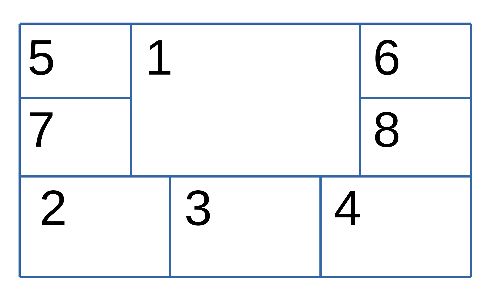 | `[1,2,3,4],[5,6,7,8]` 
 `[1],[2,3,4],[5,6,7,8]`      |                            |
| `-s 17`   `-s OffsetVH`             `-s 4x4` | 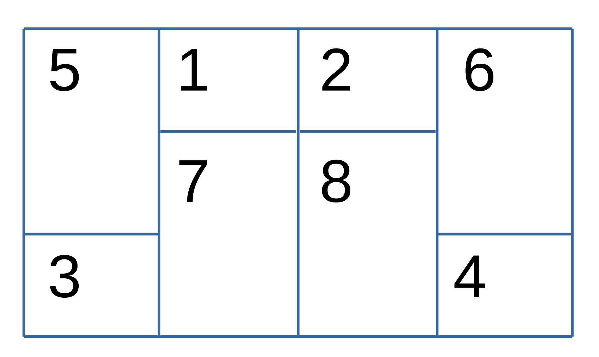 | `[1,2,3,4],[5,6,7,8]`                                   |                            |
