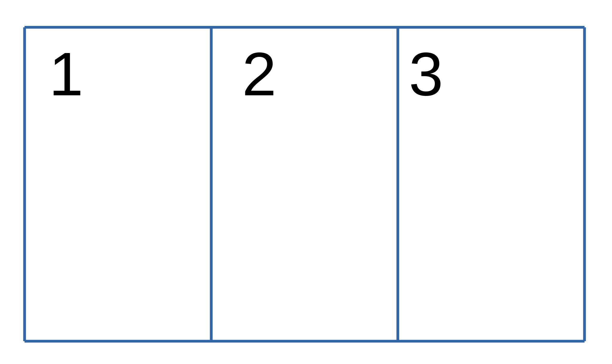
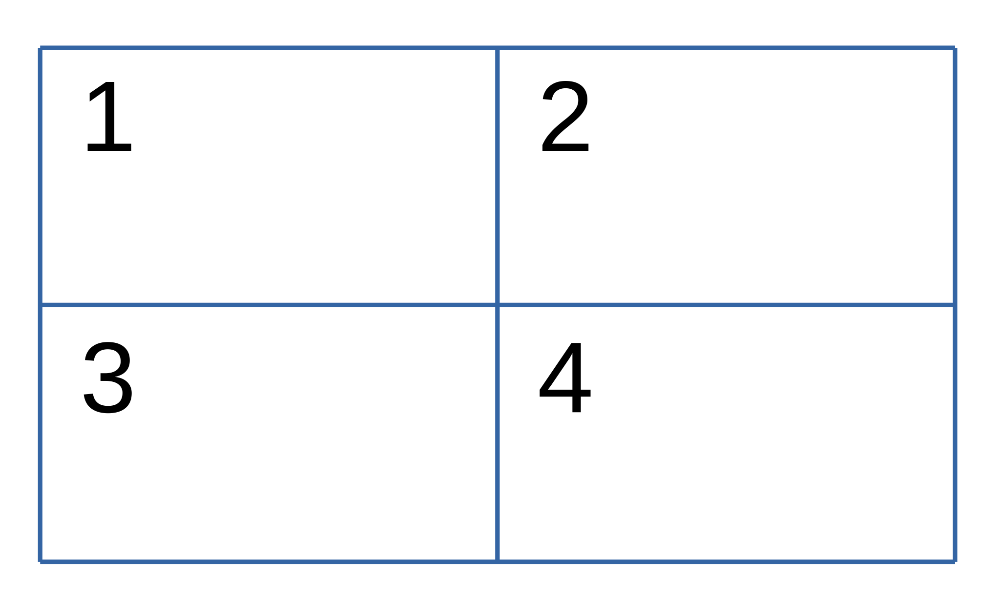
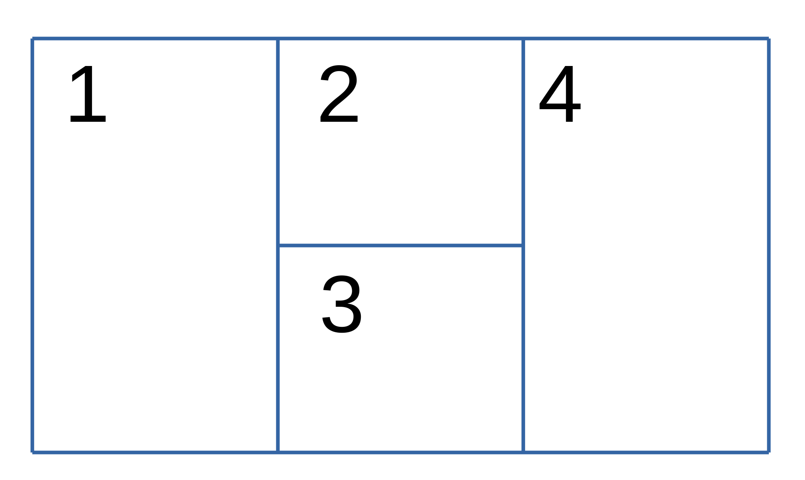
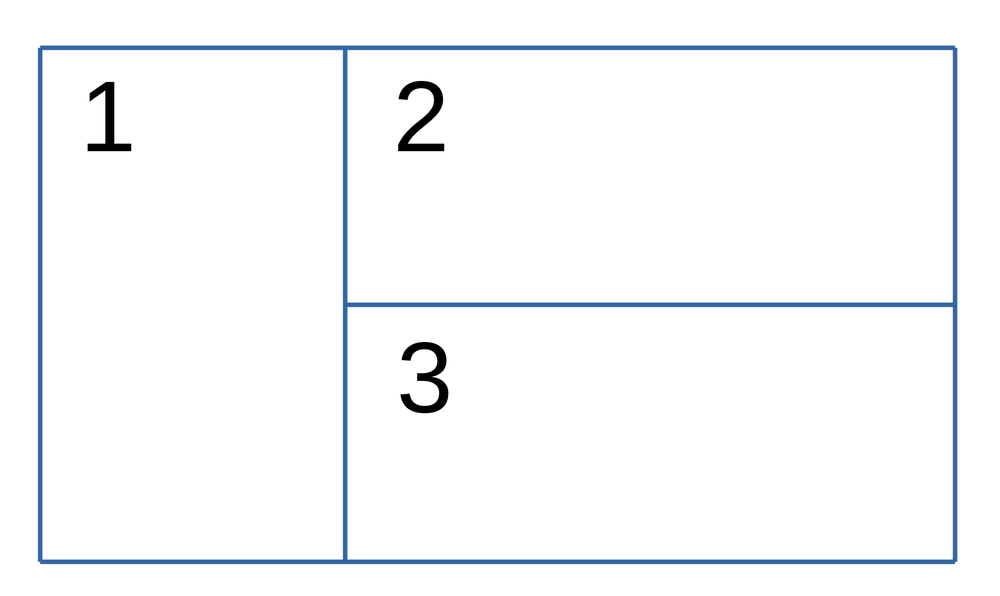
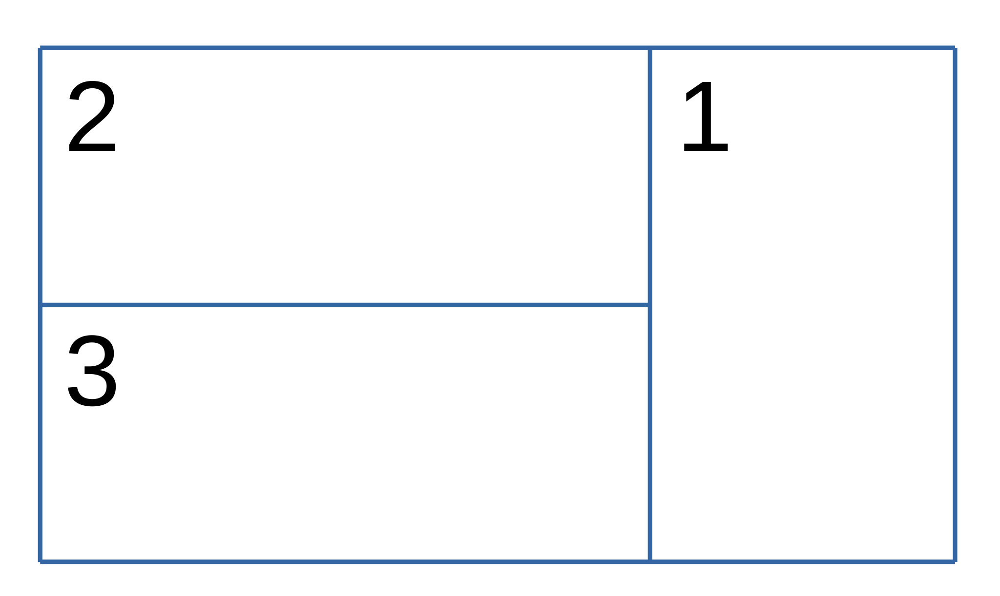

| ID | Short | Long Name           | Diagram                                     |                                          
|----|-------|---------------------|---------------------------------------------|
| 2  | `D`   | `Double`            |    |
| 3  | `T`   | `Triple`            |    |
| 4  | `Q`   | `Quad`              |    |
| 5  | `V`   | `VertEmph`          |    |
| 6  | `H`   | `HorizEmph`         |    |
| 7  | `V`   | `VertEmph`          |    |
| 8  | `H`   | `HorizEmph`         |    |
| 9  | `VD`  | `SideVert`          |    |
| 10 | `DV`  | `SideVert2`         |    |
| 11 | `CE`  | `CentreEmphVert`    |    |
| 12 | `CE2` | `CentreEmphVert2`   |  |
| 13 | `MH`  | `MoreHoriz`         |    |
| 14 | `MH2` | `MoreHoriz2`        |  |
| 15 | -     | `ExtendedLandscape` |  |
